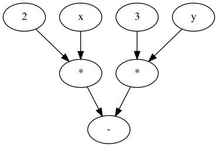

# Computational Graph

Implementation of computational graph evaluation engine that is loosely based
on how tensorflow works.

Here is an example of the graph `2x - 3y`:



One potential way to represent this graph is to define a list of nodes, e.g.:

| id | name |
| :---: | :---: |
| 1 | 2 |
| 2 | x |
| 5 | * |
| 3 | 3 |
| 4 | y |
| 6 | * |
| 7 | - |

And connect these nodes using a list of edged, e.g:

| source | dest |
| :---: | :---: |
| 1 | 5 |
| 2 | 5 |
| 3 | 6 |
| 4 | 6 |
| 5 | 7 |
| 6 | 7 |

## Run

```
python3 -m comp_graph example_graphs/diff-of-products --conf x 4 --conf y 5
```